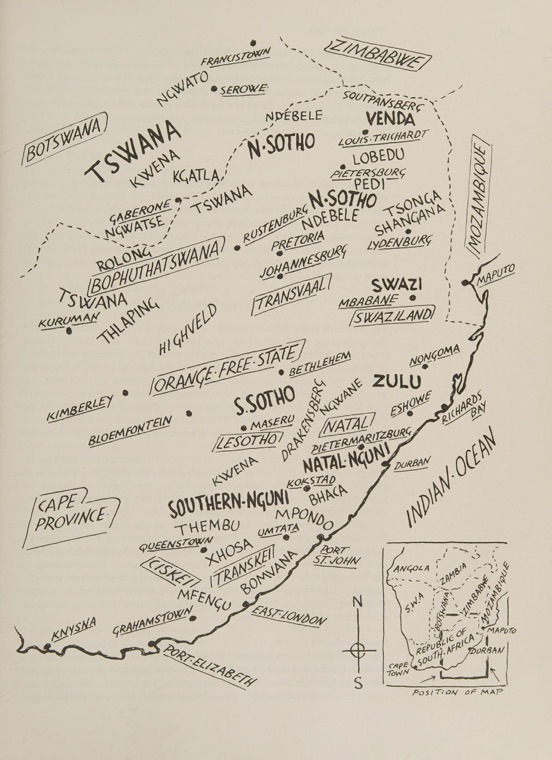

# Socio-Technical Alignment and Algorithmic Flattening: A Mixed-Methods Empirical Study of Local Music Curation in South Africa

**Author:** Shailoh (Independent Socio-Technologist & ML Practitioner)  
**Location:** Johannesburg, South Africa  
**Funding Status:** 100% Self-Funded Independent Research Pilot (For the love of pluralistic culture)
**Primary Repository:** `for the kulture`  
**License:** Apache 2.0 / Academic Open Access  

---

```
   ███████╗ ██████╗ ██████╗     ████████╗██╗  ██╗███████╗    ██╗  ██╗██╗   ██╗██╗  ████████╗██╗   ██╗██████╗ ███████╗
   ██╔════╝██╔═══██╗██╔══██╗    ╚══██╔══╝██║  ██║██╔════╝    ██║ ██╔╝██║   ██║██║  ╚══██╔══╝██║   ██║██╔══██╗██╔════╝
   █████╗  ██║   ██║██████╔╝       ██║   ███████║█████╗      █████╔╝ ██║   ██║██║     ██║   ██║   ██║██████╔╝█████╗  
   ██╔══╝  ██║   ██║██╔══██╗       ██║   ██╔══██║██╔══╝      ██╔═██╗ ██║   ██║██║     ██║   ██║   ██║██╔══██╗██╔══╝  
   ██║     ╚██████╔╝██║  ██║       ██║   ██║  ██║███████╗    ██║  ██╗╚██████╔╝███████╗██║   ╚██████╔╝██║  ██║███████╗
   ╚═╝      ╚═════╝ ╚═╝  ╚═╝       ╚═╝   ╚═╝  ╚═╝╚══════╝    ╚═╝  ╚═╝ ╚═════╝ ╚══════╝╚═╝    ╚═════╝ ╚═╝  ╚═╝╚══════╝
```

---

## 1. Abstract

This repository presents a mixed-methods explanatory sequential pilot study ($\text{QUAN} \to \text{qual}, N = 152$) on how commercial collaborative filtering recommenders handle localised South African music subgenres (*Motswako, Gqom, Lekompo, Mbaqanga, Bacardi*). 

While rooted in South African data, this pilot acts as a proof of concept for a pattern seen across the continent. In Nigeria, for example, the track *Okunkun* by Solana and Killertunes blends Yoruba cultural language with 1980s and 1990s pop-rock musical elements into a style known locally as YuroPop. Streaming platforms currently bucket it under generic Afrobeats. When platforms force artists into broad commercial categories to get discovered, they flatten distinct local styles into a single global sound.



*Map Source: African Heritage by Peter Jurgens, illustrated by Barbara Tyrell.*

We identify two structural patterns in the survey data:
1. **The Inversion Problem:** Platform delivery constraints ($C$) bias observed consumer behaviour ($B$). Completed streams reflect interface placement rather than unconstrained aesthetic preference:
   $$\mathbb{P}(B \mid M, C) \neq \mathbb{P}(B \mid M)$$
2. **The "Broken Metric" Anomaly:** Respondents report high overall platform satisfaction ($\mu = 5.83 / 7.0$), yet satisfaction scores show no statistical relationship with local discovery success ($p = 0.086$, Mann-Whitney $U = 1826.5$). When listeners switch from general listening to searching for local music, reliance on in-app recommendation algorithms drops by **7.05 percentage points** ($41.45\%$ to $34.21\%$).

Qualitative feedback clusters into three main complaints: *African Generalisation* (bundling distinct subgenres into generic regional categories), *Mainstream Recyclability* (recommenders looping the same viral tracks), and *AI De-individualisation* (rejection of conversational DJ avatars in favour of silent curation utilities).

To address these failure modes, we test two alignment approaches:
- **Paradigm A (Post-Processing Decision Boundary Alignment):** A 3-agent social choice committee based on SCRUF-D (Myopic Exploiter, Causal Arbiter using Context Tax $\tau_c$, and Adversarial Preserver) that trades off short-term engagement to guarantee local creator exposure ($\eta = 0.35$).
- **Paradigm B (In-Processing Representation Alignment):** A JAX/Flax Two-Tower neural network that projects user, item, and subgenre prototype vectors onto the unit hypersphere $\mathbb{S}^{D-1}$, training on a joint objective of Reconstruction MSE, Prototype Simplex Spanning ($\mathcal{L}_{\text{proto}}$), and an $\mathcal{O}(K^2)$ Smooth Differentiable Gini Exposure Loss ($\mathcal{L}_{\text{gini}}$).

---

## 2. How I Got Here (High-Level Overview)

This project comes from the lived reality of Pretoria and Johannesburg, where I grew up and started my career. Running this pilot confirmed that algorithmic flattening is not just a South African issue, but a pattern across African music.

```
                           [CHRONOLOGICAL RESEARCH PROVENANCE]
                                            │
        ┌───────────────────────────────────┼───────────────────────────────────┐
        ▼                                   ▼                                   ▼
 [University of Pretoria]          [Standard Bank Group]           [Vodacom Financial Services]
  BCom Economics & Stats           Behavioural Science ML            Shadow AI & Decolonial Audit
  The Neoclassical Failure        Funeral Insurance Nudges          Western LLM Monoculture
```

### The Spark: Econometric Foundations vs. Human Reality
My journey began at the **University of Pretoria**, studying Economics and Statistics. In lectures, neoclassical models treated people as rational utility maximisers. In the streets of Pretoria and Johannesburg, real human choices were communal, contextual, and constrained by infrastructure. Econometric models often broke down when applied to real-world data. Data science and machine learning offered better tools for non-linear patterns, but those models carried their own implicit assumptions.

### The Nudge: Behavioural Science at Standard Bank
Working as a Behavioural Data Scientist in **Standard Bank's Behavioural Science and Innovation team**, I curated datasets and evaluated machine learning models for our case study: *"How Nudge Messaging Can Improve Product Take-Up: A Case Study on Funeral Insurance in South Africa."* I saw how models trained solely on immediate click-through rates amplified existing vulnerabilities and missed cultural context around risk. Unconstrained optimisation produced short-term numbers, but often nudged customers away from their long-term interests. So I left to study how to balance recommendation performance with cultural fairness.

### Shadow AI at Vodacom & Rooted Refusal
At **Vodacom Financial Services**, I audited the use of "shadow AI" tools. While interviewing employees who refused to adopt AI, I discovered they shared a common frustration: chatbots required them to write long explanations to establish cultural context. Without this context, the models defaulted to Western norms. They rejected the tools not because the technology failed, but because it lacked local context, forcing them to supply it manually. They felt that constantly explaining context they innately understood wasted time and cancelled out any productivity gains.

We all pay a cultural context tax when using these systems. 

---

## 3. An Act of Creative Autonomy

This pilot raised more questions than it answered. The interaction between platform metrics and local music discovery is complex, and we are just starting to understand it.

```
                   ┌────────────────────────────────────────────────────────┐
                   │             CULTURE HACKING FROM THE MARGINS           │
                   ├────────────────────────────────────────────────────────┤
                   │  "To universalize technology without questioning its   │
                   │   cosmological origin is to perpetuate a monoculture   │
                   │   of the mind."                                        │
                   │                               ,  Yuk Hui (2016)        │
                   └────────────────────────────────────────────────────────┘
```

Self-funding kept this research independent of corporate sponsors, who often showcase local art and culture without addressing the recommendation systems that distribute it.

Music is a high-signal domain for this study. When recommendation systems compress South African subgenres (*Amapiano, Gqom, Lekompo, Maskandi*) into a flat "World Music" category, they demonstrate how algorithms flatten cultural expression.
This study is a starting point for auditing and aligning recommendation systems across African art and culture.

---

## 4. Repository Architecture and Navigation Guide

### 4.1 Physical Directory Tree
The repository uses reproducible data science and MLOps practices:

```text
/path/to/for the kulture/
├── .agents/
│   └── skills/                         # Symlinked MLOps coding skills
├── data/
│   ├── raw/
│   │   ├── fan_survey.csv              # Immutable raw survey data (N=152)
│   │   └── fan_survey_cleaned.csv      # Canonical read-only dataset
│   └── processed/
│       └── fan_survey_cleaned.csv      # Processed dataset for modelling
├── docs/                               # Mathematical & Causal Appendices
├── notebooks/                          # Exploratory Analysis & Statistical Verification
├── reports/                            # Generated Analysis Artifacts
├── representation-alignment/           # Paradigm B: JAX/Flax Neural Representation Model
├── src/                                # Core Industrialised Package (kulture) & Entrypoint Shims
├── tests/                              # Unit & Property Test Suite
├── pyproject.toml                      # PEP 621 packaging & test configuration
└── README.md                           # Master Research Portfolio Specification
```

### 4.2 Data and Logic Flow
1. **Raw Data Ingestion:** Immutable data from `data/raw/fan_survey.csv` is read.
2. **Analysis Pipeline:** The data is processed through our non-parametric tests (Mann-Whitney U, Kruskal-Wallis) due to ordinal skew.
3. **Context Tax ($\tau_c$):** Platform constraints are calculated to determine the cultural context tax for each user.
4. **Representation Alignment Loop:** The data and metrics feed into the dual paradigms: the post-processing 3-Agent SCRUF-D committee (Paradigm A) and the in-processing JAX/Flax Two-Tower model on $\mathbb{S}^{D-1}$ (Paradigm B).

### 4.3 Appendices Index
- [Appendix A: Closed-Loop Dynamics & Proof of α > 1](./docs/mathematical_derivations.md)
- [Appendix B: The Inversion Problem & CAFL](./docs/appendix_b_causal_deconfounding.md)
- [Appendix C: Hyperspherical Geometry](./docs/appendix_c_hyperspherical_geometry.md)
- [Appendix D: SCRUF-D Axiomatic Social Choice](./docs/appendix_d_social_choice_scruf_d.md)
- [Appendix E: Differentiable Gini & Pareto Optimisation](./docs/appendix_e_smooth_gini_optimization.md)
- [Appendix F: Methodological Audit & N=5000 Blueprint](./docs/appendix_f_limitations.md)
- [Directional Discovery Report](./reports/directional_discovery_report.md)

### Reproducibility Commitments
1. **Read-Only Raw Data:** `data/raw/fan_survey.csv` is immutable and treated as read-only.
2. **Path Anchoring:** File paths resolve through `src/kulture/common/paths.py` from repository root, avoiding working-directory breakage.
3. **Cache Isolation:** Compilation caches (`.jax_cache/`, `__pycache__/`) are excluded from git.
4. **Environment Portability:** Dependencies and optional groups (`jax`, `dev`, `notebooks`) are standardized in `pyproject.toml`.
5. **Static Validation:** Automated test suite in `tests/` verifies mathematical properties (L2 unit norms, Gini bounds $[0, 1]$, Context Tax bounds $[-1, 1]$).

---

## 5. Dual Alignment Paradigms

```
                                  ┌─────────────────────────────┐
                                  │   for the kulture           │
                                  │   Dual Alignment Framework  │
                                  └──────────────┬──────────────┘
                                                 │
                   ┌─────────────────────────────┴─────────────────────────────┐
                   ▼                                                           ▼
     [PARADIGM A: DECISION BOUNDARY]                            [PARADIGM B: IN-PROCESSING]
     Post-Processing Social Choice                              Spherical Neural Geometry
     3-Agent Committee (SCRUF-D)                                JAX/Flax Two-Tower on 𝕊^(D-1)
     • Myopic Exploiter                                         • Reconstruction MSE
     • Causal Arbiter (CAFL via τ_c)                            • Prototype Simplex Spanning (ℒ_proto)
     • Adversarial Preserver (Quota Q_g)                        • Differentiable Gini Index (ℒ_gini)
```

---

### Paradigm A: Post-Processing Decision Boundary Alignment (`src/`)

Paradigm A adjusts slate rankings during post-processing. It frames item selection as a 3-agent social choice problem extending SCRUF-D:

1. **Agent 1 ($A_{\text{exploit}}$): Myopic Exploiter**
   $$s_e(u, i) = \hat{y}_{ui}$$
   Ranks items by predicted user engagement from standard collaborative filtering.

2. **Agent 2 ($A_{\text{arbiter}}$): Causal Arbiter via CAFL**
   $$s_a(u, i) = \hat{y}_{ui} - \beta \cdot \max(0, \tau_c(u)) \cdot \Phi(i)$$
   Applies a Causal Alignment Framing Layer (CAFL). When a user's **Context Tax ($\tau_c$)** is positive (indicating platform delivery constraints force them to search off-platform), the Causal Arbiter discounts mainstream tracks proportional to their popularity $\Phi(i)$, estimating the unconfounded preference:
   $$\mathbb{P}\left(B = 1 \mid \text{do}(R = i), u\right)$$

3. **Agent 3 ($A_{\text{preserve}}$): Adversarial Preserver**
   $$s_p(u, i) = Q_{\text{weight}} \cdot \mathbb{I}\left(\text{genre}(i) \in \mathcal{G}_{\text{local}}\right)$$
   Enforces a baseline quota for underrepresented local subgenres (*Gqom, Lekompo*).

#### Slate Selection:
The committee combines agent preference scores into a composite score $U(u, i) = w_e s_e + w_a s_a + w_p s_p$ and runs an $\mathcal{O}(M \log M)$ greedy matroid exchange to ensure at least $Q_g$ local items in the top-$K$ slate:

$$\sum_{i \in \mathcal{S}_u^K} \mathbb{I}\left(\text{genre}(i) \in \mathcal{G}_{\text{local}}\right) \ge Q_g$$

*(See [Appendix D: Social Choice & SCRUF-D](./docs/appendix_d_social_choice_scruf_d.md)).*

---

### Paradigm B: In-Processing Representation Alignment (`representation-alignment/`)

Paradigm B intervenes inside the representation space during training using a Spherical Two-Tower neural network in JAX/Flax (with a pure-NumPy fallback).

#### 1. Hyperspherical Manifold Projection ($\mathbb{S}^{D-1}$):
To prevent mainstream songs from dominating recommendations purely through large embedding vector magnitudes, user vectors $\mathbf{u}$, item vectors $\mathbf{v}$, and learnable subgenre prototype centroids $\mathbf{p}_k$ are projected onto the unit sphere:
$$\mathbf{u} = \frac{\tilde{\mathbf{u}}}{\|\tilde{\mathbf{u}}\|_2 + \epsilon}, \quad \mathbf{v} = \frac{\tilde{\mathbf{v}}}{\|\tilde{\mathbf{v}}\|_2 + \epsilon}, \quad \mathbf{p}_k = \frac{\tilde{\mathbf{p}}_k}{\|\tilde{\mathbf{p}}_k\|_2 + \epsilon}$$
*(See [Appendix C: Hyperspherical Geometry](./docs/appendix_c_hyperspherical_geometry.md)).*

#### 2. Joint Loss Formulation:
$$\min_{\Theta} \mathcal{L}_{\text{total}} = \mathcal{L}_{\text{recon}} + \lambda_{\text{proto}} \mathcal{L}_{\text{proto}} + \lambda_{\text{gini}} \mathcal{L}_{\text{gini}}$$

Where:
- **Reconstruction MSE:**

  $$\mathcal{L}_{\text{recon}} = \frac{1}{N M} \sum_{u=1}^N \sum_{i=1}^M \left( \langle \mathbf{u}_u, \mathbf{v}_i \rangle - Y_{ui} \right)^2$$

- **Prototype Compactness & Separation Loss:**

  $$\mathcal{L}_{\text{proto}} = \frac{1}{M}\sum_{i=1}^M \left(1 - \max_k \langle \mathbf{v}_i, \mathbf{p}_k \rangle\right) + \frac{0.5}{K(K-1)}\sum_{j \neq k} \langle \mathbf{p}_j, \mathbf{p}_k \rangle$$

  Pulls item vectors toward their subgenre prototypes while pushing prototype centroids apart into a regular simplex ($\theta_{\min} = 109.47^\circ$).

- **Smooth Differentiable Gini Exposure Loss:**

  $$\mathcal{L}_{\text{gini}} = \frac{\sum_{i=1}^M \sum_{j=1}^M \sqrt{(e_i - e_j)^2 + \epsilon}}{2 M \left( \sum_{i=1}^M e_i + \epsilon_{\text{denom}} \right)}, \quad \text{where } e_i = \sum_{u=1}^N \hat{y}_{ui}$$

  Provides stable, $\mathcal{C}^\infty$ smooth gradients for exposure distribution without subgradient chatter. *(See [Appendix E: Differentiable Gini Optimisation](./docs/appendix_e_smooth_gini_optimization.md))*.

---

## 6. Pilot Findings & Core Anomaly Indicators

The survey data ($N = 152$) highlights three main patterns:

```
┌────────────────────────────────────────────────────────────────────────────────────────┐
│                               CORE EMPIRICAL ANOMALY PROOFS                            │
├────────────────────────────┬─────────────────────────────┬─────────────────────────────┤
│ Metric / Phenomenon        │ Quantitative Value          │ Practical Implication       │
├────────────────────────────┼─────────────────────────────┼─────────────────────────────┤
│ 1. Local Discovery Gap     │ -7.05 percentage points     │ In-app algorithm reliance   │
│                            │ (41.45% -> 34.21%)          │ drops for local tracks.     │
├────────────────────────────┼─────────────────────────────┼─────────────────────────────┤
│ 2. The Broken Metric       │ p = 0.086 (Mann-Whitney U)  │ Satisfaction ratings do not │
│    Decoupling              │ Mean = 5.83 / 7.0           │ reflect local discovery.    │
├────────────────────────────┼─────────────────────────────┼─────────────────────────────┤
│ 3. Platform-Hopping        │ 100% Rule Confidence        │ Listeners keep multiple     │
│    Workaround (Apriori)    │ Lift = 1.15                 │ services as a workaround.   │
└────────────────────────────┴─────────────────────────────┴─────────────────────────────┘
```

1. **The Inversion Shift:** When listeners look for local music instead of international tracks, algorithmic discovery drops by **7.05 percentage points**, while external social media discovery (TikTok / Instagram) rises by **4.61 percentage points**.
2. **The "Broken Metric" Failure:** Recommender satisfaction ratings average $5.83/7.0$, but listeners who discover local artists rate the platform essentially the same as listeners who do not ($p = 0.086$). High satisfaction scores mask poor local discovery.
3. **The Multi-Platform Workaround:** Apriori association rule mining shows with **100% confidence** that respondents using Apple Music or YouTube Music frequently maintain secondary Spotify accounts specifically to find local artists.

---

## 7. Pilot Limitations & Scaled Horizon

### Pilot Boundaries
As detailed in [Appendix F: Pilot Limitations](./docs/appendix_f_limitations.md), this pilot has clear constraints:
- **Sample Size ($N=152$):** A sample-to-feature ratio of $\frac{N}{p} \approx 3.62$ and a Minimum Detectable Effect of $d_{\text{MDE}} = 0.457$ means the dataset cannot reliably fit supervised predictive classifiers.
- **Geographic Concentration:** Over $50\%$ of respondents live in Gauteng, reflecting urban connectivity rather than rural realities where mobile data tariffs (R85-R120/GB) lead to offline sharing through local hubs like taxi ranks.
- **Categorical Sparsity:** High-cardinality cross-tabulations show cell counts below 5 in $91.7\%$ of cells, violating Cochran's criterion for chi-square tests.

---

### Research Expansion Blueprint

We welcome collaboration with research groups at Google Research and Google DeepMind to refine and scale this framework:

```
                        ┌────────────────────────────────────────────────────────┐
                        │      THE SCALED HORIZON BLUEPRINT (N = 5,000)          │
                        ├────────────────────────────────────────────────────────┤
                        │ 1. Multi-Cause Latent Deconfounding (MCLD) via VAEs    │
                        │ 2. National 9-Province Stratification (Rural Ingestion)│
                        │ 3. 1,000,000+ Track Catalog on JAX Cloud Clusters      │
                        └────────────────────────────────────────────────────────┘
```

Scaling this pilot to a nationally representative cohort ($N = 5,000$) across all nine South African provinces and testing on full-scale catalogs ($K > 1,000,000$ tracks) will help build recommender systems that support rather than flatten local cultural expression.

---

## Ethical Considerations & Broader Impact

Deploying algorithmic recommendation systems in post-apartheid South Africa carries major socio-technical implications. The pilot survey data ($N=152$) concentrates in Gauteng, introducing structural selection bias that fails to reflect rural listening patterns or high mobile data tariffs. Relying on this data to align recommendation committees risks reinforcing socio-economic disparities. Applying social choice frameworks like SCRUF-D or hyperspherical alignment models to preserve culture relies on categorizing artistic expression into static subgenre boundaries. This classification can flatten the dynamic, hybrid, and evolving nature of South African music scenes, turning fluid cultural identities into fixed mathematical constraints.

## Citation

If you use this repository or its research design in your work, please cite it as follows:

```bibtex
@misc{shailoh2026kulture,
  author       = {Shailoh},
  title        = {Socio-Technical Alignment and Algorithmic Flattening: A Mixed-Methods Empirical Study of Local Music Curation in South Africa},
  year         = {2026},
  publisher    = {GitHub},
  journal      = {GitHub Repository},
  howpublished = {\url{https://github.com/shailoh/for-the-kulture}}
}
```

---

## Quickstart & Execution Guide

### 1. Environment Setup
```bash
# Clone repository
git clone https://github.com/shailoh/for-the-kulture.git
cd for-the-kulture

# Initialize virtual environment with Python >= 3.10
python3 -m venv .venv && source .venv/bin/activate

# Upgrade pip and install the project in editable mode with all dependencies
pip install --upgrade pip && pip install -e .[dev,jax]
```

### 2. Run Automated Verification Suite
```bash
# Run unit tests
python -m unittest discover -s tests -p "test_*.py" -v
```

### 3. Execute Paradigm A (SCRUF-D & Stats Pipeline)
```bash
# Calculate Cultural Context Tax
python src/context_tax.py

# Run 3-Agent Social Choice Recommendation Committee
python src/models.py

# Run Inversion Shift & LDA Topic Modelling
python src/analysis.py
```

### 4. Execute Paradigm B (JAX/Flax Hyperspherical Training)
```bash
# Train Spherical Two-Tower Model
python representation-alignment/src/train.py

# Run Hyperparameter Pareto Ablation Grid
python representation-alignment/src/ablation_study.py

# Export Spherical Embeddings & Prototype Centroids
python representation-alignment/src/export_embeddings.py
```

---
